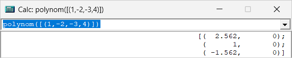
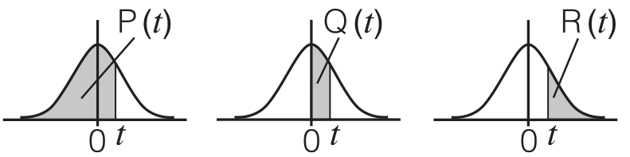

# WinAPI Calculator
<br>
[Русская версия / Russian version](Readme_ru.md)

A scientific calculator with both **GUI** and **CLI** versions, built using pure Win32 API without MFC dependencies. Supports various number formats, binary operations with configurable width, advanced mathematical functions, complex numbers, matrices (up to 7×7), user-defined functions, and loading custom constants from a file.

This calculator project on WinAPI (VS2022) is based on my old project on Cbuilder VCL (BCB6) [fcalc](https://github.com/dimorlus/fcalc), which, in turn, is based on DOS programs and [Ccalc](http://www.garret.ru/ccalc.zip) sources that have been heavily reworked since then.
```
//-< CCALC.CPP >-----------------------------------------------------*--------*
// Ccalc                      Version 1.02       (c) 1998  GARRET    *     ?  *
// (C expression command line calculator)                            *   /\|  *
//                                                                   *  /  \  *
//                          Created:     20-Oct-98    K.A. Knizhnik  * / [] \ *
//                          Last update: 20-Oct-98    K.A. Knizhnik  * GARRET *
//-------------------------------------------------------------------*--------* 
```
The ***Casio Fx-991EX*** calculator served as a source of inspiration and ideas.

## Important note. 

The DLL version is only available for 64-bit systems and is compiled using 128-bit floating-point numbers (IEEE 754-2008 quadruple precision (binary128)). This format is used only for actual calculations; input data is processed as 64-bit (IEEE 754), and output is processed only in forced float mode and with the selected precision prec(34) (default: 16 digits).

|Version|Type (bit)         |Exponent (bit) |Mantissa (bit) |Precision (digits) |Range (approximately)      |
|-------|-------------------|---------------|---------------|-------------------|---------------------------|
|std    |Double (64)        |11             |52             |15..17             |±2.2E-308 ..  ±1.8E+308    |
|bcb    |Long Double (80)   |15             |64             |18..19             |±3.4E-4932 .. ±1.1E+4932   |
|dll    |Quad (128)         |15             |112 (+1)       |33..36             |±3.4E-4932 .. ±1.2E+4932   |

Since number input is processed as double, it's not possible to directly enter a number outside the double range, even in the 80- 
or 128-bit versions. However, you can enter 1.234*10^1234.

## Two Versions Available

### 📊 GUI Version (WinApiCalc / fcalc.exe)

Windows desktop application with native interface, history dropdown, and real-time calculation.

### 💻 CLI Version (ccalc.exe)

Command-line calculator for scripts, automation, and terminal use.

## Features

### GUI Version (WinApiCalc)

* **Scientific Calculator**: Support for trigonometric functions, logarithms, exponentials, and more
* **Expression Parser**: Advanced mathematical expression evaluation with proper operator precedence
* **History Dropdown**: Keep track of previous calculations with easy access through dropdown menu (auto-saves on exit)
* **DPI Awareness**: Automatic scaling for high-DPI displays
* **CHM Help Support**: F1 help integration for external help files
* **Standard Windows Interface**: Native menus, keyboard shortcuts, and clipboard integration
* **Multiple Output Formats**: Display results in decimal, hexadecimal, octal, binary, scientific notation, etc.
* **Configurable Binary Width**: Choose binary display width from 8 to 64 bits
* **Variables Dialog**: View and manage calculation variables
* **Customizable Options**: Case sensitivity, forced float mode, ESC minimization, opacity control
* **Implicit Multiplication**: Optionally omit multiplication operator in common cases
* **User-Defined Functions**: Define and nest custom functions (up to 10 levels deep)
* **Custom Constants File**: Load user-defined constants and functions from `consts.txt` and `user.txt`
* **Matrix Support**: Full matrix arithmetic up to 7×7, including inverse, determinant, transpose
* **Numerical Methods**: Equation solving (`solve`), integration (`integr`), differentiation (`diff`), summation (`sum`)

### CLI Version (ccalc)

* **Command-line interface**: Perfect for scripts and automation
* **Same calculation engine**: Identical mathematical capabilities as GUI version
* **Multiple output formats**: Supports all format options via command-line flags
* **Configuration file support**: Load default options from `ccalc.cfg`
* **Batch processing**: Process expressions from scripts or command line
* **Built-in help system**: Access help via `ccalc "help(n)"` command

#### CLI Usage

```
# Basic calculations (always use quotes!)
ccalc "2+2"
ccalc "sqrt(3^2+4^2)"
ccalc "sin(pi/4)"

# With options
ccalc "0xFF + 0b1010" /HEX+ /BIN+
ccalc "2k5" /SCI+               # 2500 with scientific notation
ccalc "2+3i" /NRM+              # Complex numbers
ccalc "2+3i" /CPX+              # Complex numbers in polar form

# Show help
ccalc "help(0)"                 # Overview
ccalc "help(1)"                 # Functions
ccalc "help(4)"                 # Constants (including physical constants)
ccalc "help(7)"                 # Options

# Configuration file (ccalc.cfg)
# Place in same directory as ccalc.exe
/SCI+ /IMUL+ /BW=64
```

#### Batch Processing (File or Stdin)

Process a file of expressions line by line, redirecting output to a file:
```
ccalc /ALL-/AUTO+/SRC+/FILE="apicalc_cli_tests.txt" >result.txt
```
Or via stdin pipe:
```
type apicalc_cli_tests.txt | ccalc /ALL-/AUTO+/SRC+ >result.txt
```
With `/SRC+` each output line includes the source expression:
```
-1^2 ;; -(1^2), not (-1)^2 => -1
integr(exp(-(x^2)), -5, 5, x) ;; sqrt(pi) => 1.77245385090552
```
Without `/SRC+` only results are printed, one per line:
```
-1
1.77245385090552
```

Lines starting with `;;` are comments and produce no output. Blank lines are passed through as blank lines.

The CLI version allows to specify options in the expression comment that determine the output format when the `/AUTO+` option is enabled, which determines 
the output format based on the input format. For example
```
   L:=130u;;Inductance /ALL-/FLT+ => 0.00013
   5`42'38";;/ALL-/DEG+ => 0.099668 rad|5`42'38" (5.71056`)|6.345 gon|0.01586 turn
   2sin(15`42'38");;/ALL-/ENG+ => 541.6m
   
  ;Output Format Options:
  /DEG+         ;Degrees format
  /ENG+         ;Engineering (Scientific) numbers format (6k8 => 6800)
  /STR+         ;String format 
  /HEX+         ;Hex format
  /OCT+         ;Octal format
  /BIN+         ;Binary format
  /DAT+         ;Date time format
  /CHR+         ;Char format
  /WCH+         ;WChar format
  /CMP+         ;Computing format
  /UTM+         ;Unix time format
  /NRM+         ;Normalized output
  /IGR+         ;Integer output
  /UNS+         ;Unsigned output
  /FRC+         ;Fraction output format
  /FCT+         ;Factorize output format
  /FRI+         ;Fraction inch output
  /FRH+         ;Temperature
  /FLT+         ;Floating point output
  /UTM+         ;Unix time
  /ALL+         ;All of the above 
```
>**IMPORTANT**: Always use quotes around expressions! Symbols like `^`, `|`, `&`, `<`, `>` have special meaning in PowerShell/CMD.

## Supported Functions

### Basic Operations

* Addition `+`, Subtraction `-`, Multiplication `*`, Division `/`
* Modulo `%`, Power `^`
* Percentage `%` and `%%`
* Parentheses `()` for grouping
* `;` to separate expressions

> **Note**: Unary minus has lower priority than power: `-1^2 = -(1^2) = -1`, not `(-1)^2 = 1`. Use parentheses when needed: `(-1)^2 = 1`.

### Percentage Operations

The `%` operator in `x op y%` computes `y%` as a percentage **of the left operand** `x`, then applies the operation:
```
x op y%  →  x op (x * y / 100)
```
Except for the `*` and `/` operations, which are evaluated as
```
x * y%  →  x * (y / 100)
x / y%  →  x / (y / 100)
```
This matches the behaviour of most pocket calculators:
```
72 - 20%          →  57.6      (72 - 72*0.20 = 72*0.80)
200 + 10%         →  220       (200 + 200*0.10)
150 * 20%         →  30        (150 * 20/100 = 30)
150 / 20%         →  750       (150 / (20/100) = 750)
1 / 2%            →  50        (1 / (2/100 = 50)
```
Chained percentage operations use the result of the previous operation as the new base:
```
72 - 20% + 5%     →  60.48     (57.6 + 57.6*0.05)
```
The `%%` operator is the **reverse percentage**: how many percent is `x` relative to `y` as a change from `y`:
```
x %% y  →  (x / y - 1) * 100

57.6 %% 72        →  -20       (57.6 is 20% less than 72)
```

### Mathematical Functions

* **Trigonometric**: sin, cos, tan, asin, acos, atan
* **Hyperbolic**: sinh, cosh, tanh
* **Logarithmic**: ln, log (natural log), lg (base 10)
* **Other**: sqrt, exp, abs, floor, ceil, round

### Utility Functions and solvers

* **pol**: Convert to polar coordinates
* **const("name", value)**: Define a named constant programmatically
* **var("name", value)**: Define a named variable programmatically
* **wrgb, trgb**: Color-related utility functions
* **winf**: Returns a string describing the portion of the spectrum of a given wavelength
* **frh(x)**: Convert Fahrenheit to Celsius (e.g., `frh(75)` → 23.89°C)
* **bind(x)**, **binf(x)**: Reinterpret a floating-point value as an integer by its raw bit pattern (the inverse of `floatd`/`floatf`). Useful for inspecting IEEE 754 representation:
  ```
  bind(pi)   →  400921fb54442d18h   ;; double (64-bit) bit pattern of π
  binf(pi)   →  40490fdbh           ;; float (32-bit) bit pattern of π
  ```
* **floatd(x)**, **floatf(x)**: Reinterpret an integer as a floating-point value by its raw bit pattern (the inverse of `bind`/`binf`):
  ```
  floatd(0x400921FB54442D18)  →  3.14159265358979   ;; reconstruct π from bits
  floatf(0x40490FDB)          →  3.141593           ;; 32-bit float precision
  floatd(bind(pi))            →  3.14159265358979   ;; round-trip
  ```
* **cmplx / cpx / cplx(a, b)**: Construct a complex number (all three are synonyms)
* **prn("format", ...)**: Formatted print, e.g., `prn("f:%SHz, Rw:%SOhm", f, Rw)`
* **prnf("filename", "format", ...)**: Works the same as prn, but appends the created string to the end of the file 'filename' (if it doesn't exist, it creates it). Returns the number of characters written to the file (0 if writing to the file is impossible).
* **polar(m, a)**: Construct a complex number from magnitude and angle in radians, or in degrees using the `` degrees`minutes'seconds" `` format:
  ```
  polar(10, 30`)        →  |10|(30`0'0")   8.660254+4.999999i
  polar(10k, 30`20'40") →  |10k|(30`20'40")  8.63k+5.052ki
  ```
  m and a also can be complex according formula   $$z = m \cdot e^{ia}$$.
  This function is built-in (previously defined in `consts.txt`).
* **solve(expr, var:=estimate)**: Find root (also complex) of equation `expr(var)=0` using Newton-Raphson method. The last variable in the initial conditions is the one being solved for:
  ```
  solve(x*(2x+2)-2, x:=0)   →  0.6180339887500326
  solve(x*(2x+2)-2, x:=-1)  →  -1.61803398875005
  solve(z^2+z+1, z:=0+1i)   →  |1|(120`0'0") -0.4999999999999997+0.8660254037844385i
  ```
  Can be used as an operand in complex expressions: `sqrt(solve(...))`.
* **calc(expr, var:=val)**: Evaluate expression for a given variable value — useful for selecting initial approximation for `solve`:
  ```
  calc(x*(2x+2)-2, x:=-1)  →  -2
  calc(z^2+z+1, z:=0+1i)   →  |1|(90`0'0") 0+1i
  ```
* **integr(expr, from, to, var)**: Numerical integration using adaptive Gauss-Kronrod G7/K15 method:
  $$\int_{-5}^{5} e^{-x^2}\,dx = \sqrt{\pi} \approx 1.7725$$
  ```
  integr(exp(-(x^2)), -5, 5, x)  →  1.772453850902790   ;; sqrt(pi)
  integral(exp(-(x^2)), -5, 5, x)  →  1.772453850902790   ;; sqrt(pi)
  integr(sin(x)/x, 0.001, pi, x) →  1.850937052038021
  ```
  Can be used as operand: `sqrt(integr(sin(x)^2, 0, 2*pi, x))`.
* **diff(expr, point, var)**: Numerical differentiation using central difference method:
  ```
  diff(sin(x), pi/4, x)  →  0.7071...   ;; cos(pi/4)
  ```
* **sum(expr, from, to, var)**: Summation over integer range. Supports both ascending and descending order:
  ```
  sum(1/x!, 0, 10, x)   →  2.718281525573192   ;; partial sum of e
  sum(1/x!, 20, 0, x)-e →  0                   ;; reverse order = exact result
  ```
* **for(expr, from, to, var)**: Execution over integer range, return `expr` value (any type including matrix and complex). Supports both ascending and descending order:
  ```
  r:=3;A:=zeros(r,r);for(A[n/r,n%r]:=n;A, 0, r*r-1, n) → [(0, 1, 2); (3, 4, 5); (6, 7, 8)]
  ```
* **if(cond, true, false)**: If the first operand `cond` is not 0, the second operand `true` returns; otherwise, the third operand `false` returns. The returned operands can be any type, including different types.  
  ```
  if(x>0,1,-1)
  {sign(x)if(x>0,1,-1)}
  ```   
* **polynom([(a, b, c)])**: function find roots of polynomial given coefficients in a  row-matrix. Coefficients ordered from highest degree 
to constant: <br>$$[a_n, a_{n-1}, \dots, a_1, a_0]$$ for polynomial: $$a_nx^{n} + a_{n-1}x^{n-1} + \dots + a_1x + a_0 = 0$$.<br> 
Returns a matrix of complex roots (N rows × 2 cols: [real_part, imag_part]). Supports polynomials up to degree 4 having an analytical 
solution. Polynomial $$degree > 4$$: use Durand-Kerner method (numerical).
   The quadratic equation: $$x^2 + 2x + 3 = 0$$. Roots: $$-1 \pm i\sqrt{2} \approx -1 \pm 1.414i$$.
```
  polynom([(1,2,3)]) → [(-1, 1.414); (-1, -1.414)];; roots -1+1.414i, -1-1.414i
```  

### **Complex Number Support**

* All mathematical operations and functions (including trigonometric, hyperbolic, exponential, logarithmic, power, and square root) support complex arguments and return complex results where appropriate.
* Functions like `sqrt`, `log`, `ln`, `asin`, `acos`, `pow` and operator `^` automatically switch to the complex version when the real result is undefined — for example `sqrt(-1)` returns ```|1|(90`0'0") 0+1i``` instead of NaN.
* Complex numbers can be entered in the form `a+bi` or `a+ib` (e.g., `1+2i`, `1+i2`, `3-4i`).
* Both `(i, j)` symbols are supported for the imaginary part. The last symbol used in the input is used when outputting the result.
* Functions like `sin`, `cos`, `exp`, `abs`, etc., work with both real and complex arguments.
* The result is displayed in the form `a+bi` if the imaginary part is nonzero.
* The `~` operator on a complex number returns its **complex conjugate** (negates the imaginary part). On integers, `~` performs bitwise NOT.
* When the result is complex, it is displayed in **both rectangular and polar forms** for convenience:
  ```
  ~(1+2j)  →  |2.236068|(-63`-26'-5")  1-2j
  ```
  Polar form notation: ``|modulus|(degrees`minutes'seconds")``

### User-Defined Functions

User-defined functions can be specified inline or loaded from `consts.txt`:
```
{frq(L, C)  1/(2*pi*sqrt(L*C))};;Resonant frequency, Hz
```
Then use them in expressions:
```
frq(130u, 2n2) → 297602.87 
```

**Key properties:**

* Functions can be nested up to **10 levels** deep.
* When a user-defined function is called, all previously defined constants (including those from `consts.txt`) are available inside it, but not variables.
* User-defined functions can be **overridden** by re-declaring them (previously, re-declarations were silently ignored).
* Type checking is enforced on function arguments — for example, you cannot call `sin` on a string.

### Comments

Use the `;;` operator for inline comments:
```
2+2 ;; This is a comment
```

### Matrix Support

Matrices up to 7×7 are supported. Matrix syntax:
```
[(a11, a12, ...); (a21, a22, ...); ...]
```
Each row is enclosed in `()`, rows are separated by `;`, the whole matrix is enclosed in `[]`. Elements can be plain numbers (SI suffixes supported) or expressions using previously defined constants and variables, as long as the result is a real number or integer. Complex numbers, strings, or matrices cannot be matrix elements. Variables declared inside the matrix are local to it and not accessible afterwards:
```
[(-1k, 2m, 3M); (4, 5u, 6n); (7p, 8G, 9)]
[(a:=2*pi, a/3); (b:=e, b/2)]  →  [(6.283, 2.094); (2.718, 1.359)]
```
When the result is a matrix, it is displayed in engineering format, one row per line:
```
[(     1,      2,      3);
 (     4,      5,      6);
 (     7,      8,      9)]
```
Matrix elements can be accessed by index [row, col] for both reading and writing. Rows and cols are zero-based.
```
A := [(1,2,3);(4,5,6);(7,8,9)]
A[1,1] → 5
A[1,1] := 10;A → [(1,2,3);(4,10,6);(7,8,9)]
```
Access to a matrix element by index is possible both by row and column, and by a single through index.
```
[(1, 2, 3); (4, 5, 6); (7, 8, 9)][1,1] → 5
[(1, 2, 3); (4, 5, 6); (7, 8, 9)][4] → 5
```
Elements that are negligibly small compared to the matrix norm (Frobenius) are displayed as zero to suppress numerical noise. Using index access, you can view the unfiltered value of an element.
```
[(-1k, 2m, 3M); (4, 5u, 6n); (7p, 8G, 9)] → [(-1k, 0, 3M); (0, 0, 0); (0, 8G, 9)] ;;Filtered
[(-1k, 2m, 3M); (4, 5u, 6n); (7p, 8G, 9)][1,1] → 5e-06                            ;;Raw
```

#### Matrix Operations

**Binary operators** (where `M` = matrix, `s` = scalar):

| Expression         | Result | Notes                                 |
| ------------------ | ------ | ------------------------------------- |
| `M + M`            | matrix | element-wise, dimensions must match   |
| `M - M`            | matrix | element-wise                          |
| `M * M`            | matrix | true matrix multiplication            |
| `M + s`, `s + M`   | matrix | scalar added to each element          |
| `M - s`, `s - M`   | matrix |                                       |
| `M * s`, `s * M`   | matrix | scalar multiplication                 |
| `M / s`            | matrix | divide each element by scalar         |
| `s / M`            | matrix | divide scalar by each element         |
| `M ^ n`            | matrix | integer power n≥0, square matrix only |
| `M == M`, `M != M` | 0 or 1 | all elements equal?                   |
| `M // s`, `M // M` | matrix | parallel resistors, element-wise      |

**Unary operators:**

| Expression | Result | Notes                               |
| ---------- | ------ | ----------------------------------- |
| `-M`       | matrix | negate all elements                 |
| `~M`       | matrix | transpose (rows ↔ columns)          |
| `!M`       | matrix | matrix inverse (square matrix only) |

#### Matrix Functions

| Function           | Returns | Notes                                                        |
|--------------------|---------| -------------------------------------------------------------|
| `tr(M)`            | scalar  | trace — sum of diagonal elements                             |
| `det(M)`           | scalar  | determinant, square matrix only                              |
| `norm(M)`          | scalar  | Frobenius norm √(Σ aᵢⱼ²)                                     |
| `abs(M)`           | matrix  | element-wise absolute value                                  |
| `dot(A, B)`        | scalar  | dot product of two vectors (1×N or N×1), any length          |
| `cross(A, B)`      | vector  | cross product of two 3-element vectors (1×3 or 3×1)          |
| `rows(M)`          | scalar  | Return rows of matrix                                        |
| `cols(M)`          | scalar  | Return columns of matrix                                     |
| `size(M)`          | scalar  | Return rows\*columns of matrix                               |
| `zeros(r,c)`       | matrix  | Return zero matrix with r rows and c columns                 |
|`diag(r,c),eye(r,c)`| matrix  | Return zero matrix with r rows and c columns with 1 diagonal |

The **int**, **float**, **round**, **floor**, **ceil**, and **frac** functions can accept and return matrices, processing them element-by-element. 
The **rnd** (**rand**) function returns a matrix of the same size as the original, filled with random numbers with a base chosen as the RMS of the original matrix.

#### Matrix Examples

```
A := [(1,2,3);(4,5,6);(7,8,9)]
D := [(1,2);(3,4)]

A + 2            →  [(3,4,5);(6,7,8);(9,10,11)]
A * 2            →  [(2,4,6);(8,10,12);(14,16,18)]
~A               →  [(1,4,7);(2,5,8);(3,6,9)]     ;; transpose
D^2              →  [(7,10);(15,22)]
!D               →  [(-2,1);(1.5,-0.5)]           ;; inverse
D * !D           →  [(1,0);(0,1)]                 ;; identity
tr(A)            →  15
det(D)           →  -2
norm(D)          →  5.477225575051661

;; vectors (row or column):
dot([(1,2,3)], [(4,5,6)])          			→  32
dot([(3,4)], [(3,4)])              			→  25     ;; = norm^2
cross([(1,0,0)], [(0,1,0)])        			→  [(0,0,1)]
cross([(1,2,3)], [(4,-1,2)])       			→  [(7,10,-9)]
dot(cross([(1,2,3)],[(4,-1,2)]), [(1,2,3)]) → 0  ;; cross product ⊥ both inputs

r:=3;A:=zeros(r,r);for(A[n/r,n%r]:=n;A, 0, r*r-1, n) → [(0, 1, 2); (3, 4, 5); (6, 7, 8)]
r:=3;A:=zeros(r,r);for(A[n]:=n;A, 0, r*r-1, n) → [(0, 1, 2); (3, 4, 5); (6, 7, 8)]
zeros([(1, 2, 3); (4, 5, 6); (7, 8, 9)]) → [(0, 0, 0); (0, 0, 0); (0, 0, 0)]
zeros(3,3) → [(0, 0, 0); (0, 0, 0); (0, 0, 0)]
eye([(0, 0, 0); (0, 0, 0); (0, 0, 0)]) → [(1, 0, 0); (0, 1, 0); (0, 0, 1)]

F1:=[(10, 5, 0)]; F2:=[(0, 10, 5)];degr:=angle(F1, F2)/deg → 66.42182152179818
V_sns:=[(10); (0)]; ang:=pi/4;V_global:= rot2(ang) V_sns → [(7.071); (7.071)]
```

$$\begin{cases} 2x - 3y = -4 \\\\ 3x - 2y = -1 \end{cases} \Rightarrow \begin{pmatrix} x \\\\ y \end{pmatrix} = \begin{pmatrix} 1 \\\\ 2 \end{pmatrix}$$
```
;;From consts.txt:
;; Solves a system of linear equations A*X = B (returns vector X)
{solve_lin(A, B) !A * B}

solve_lin([(2, -3);(3, -2)],[(-4);(-1)]) → [(1); (2)]

;;Do not try to repeat with the same result, the data is random.
rand(zeros(3,3)+10) → [(2.988, 9.108, 9.058); (6.294, 2.281, 3.198); (8.518, 9.509, 7.563)]
round(rand(zeros(3,3)+10)) → [(2, 4, 4); (6, 3, 2); (2, 7, 7)]
```
### Data Format & File Handling

#### File Requirements
* **Plain Text Only**: Data must be in a standard text format (e.g., .txt, .csv, .log, .dat). Binary formats like 
.xlsx, .pdf, or .docx are not supported.<br>
* **Encoding**: Standard ASCII or UTF-8 is recommended.

#### File Paths & Syntax
* **Flexible Separators**: The engine supports both Windows-style backslashes (`\`) and Unix-style forward slashes (`/`). 
You can even mix them — the parser will correctly locate the file.
* **Flexible Quotes**: Use either double quotes ("path") or single quotes ('path') to define filenames. 
The only requirement is that they must be paired.
* **Universal Paths**: Any combination of forward slashes (`/`) and backslashes (`\`) is valid. The engine transparently 
handles path normalization.

* *Valid*: 'C:/Data/log.txt'
* *Valid*: "logs\sensor_data.csv"
* *Valid*: 'c:\projects/test/data.dat'

#### File Paths:
* *Relative paths* (e.g., "logs/data.txt") are relative to the calculator executable. 
* *Full paths* (e.g., "C:\Projects\Test\sensor.log") are supported.  

#### The "All-Terrain" Parser
The engine uses a robust, fault-tolerant scanner designed to extract numeric data from real-world engineering logs.
* **Header & Comment Stripping**: The parser automatically skips non-numeric text at the beginning of lines, making 
it easy to process files with headers or metadata.Engineering Notation: Full support for standard suffixes: k (kilo, $$10^3$$), 
M (mega, $$10^6$$), etc.
* **Delimiter Agnostic**: While comma-separated values (CSV) are standard, the parser handles spaces, tabs, and semicolons 
gracefully.

#### Column Selection (Advanced Masks)
For files with multiple columns, all `fit*` and statistical functions support an optional **Column Mask** argument. 
This allows you to select specific columns from the data string and define their order (e.g., swapping X and Y).

**Mask Syntax:**
* **Numbers (0-9)**: The index of the argument to be captured, starting from 0.
* **Wildcards (`*`, `-`, `#`, etc.)**: Any non-numeric, non-space character acts as a skip marker for a numeric value.
* **Spaces**: Optional visual separators used to improve readability.

**Examples:**
Assuming a data line contains 5 numeric values: `[Val0, Val1, Val2, Val3, Val4]`.

* **Default (No Mask)**: `fitpoly("data.log", 2)` — Uses `Val0` as X and `Val1` as Y.
* **Column Swapping**: `fitpoly("data.log", "1 0", 2)` — Uses `Val1` as X and `Val0` as Y.
* **Specific Selection**: `fitpoly("data.log", "* 1 * 0", 2)` — Skips `Val0`, uses `Val1` as X, skips `Val2`, and uses `Val3` as Y.
* **Single Column Selection**: `mean("data.log", "**0")` — Calculates the mean only for the 3rd numeric column (`Val2`).

> **Tip**: Since engineering logs often contain dates (e.g., `2026-04-22`), the parser treats each part of the date as a separate number. 
Use a mask like `*** 0 1` to skip the date and jump straight to your data columns.

> **Data Safety**: If a mask is invalid (e.g., `"1 1"` for two variables) or the data line is incomplete, the engine ensures integrity by 
initializing results with `qnan`. These lines are automatically ignored during analysis, preventing corrupted calculations.

#### Data Structures for Different Modes
* **Statistical Functions** (mean, median, rms, etc.):<br>
*Expected format*: A single column of numbers. If multiple columns exist, the parser takes the first number found on each line.
* **Regression Functions** (fitpoly, fitexp, etc.):<br>
*Expected format*: Two columns representing $$X$$ and $$Y$$ coordinates. If only one column is present, the line number (index) 
is used as the $$X$$ value. Example of a "Dirty" Log File (Supported)
```
# Experiment: NTC Thermistor Test
# Date: 2026-04-21
# Channel A: Temperature (C), Channel B: Resistance (Ohm)

Temp: 25.0    Res: 10.0k
Temp: 30.5    Res: 8.2k  (Stable)
Temp: 40.0    Res: 5.5k  -- sensor jitter here --
# End of log
```
The parser will cleanly extract pairs: `(25.0, 10000)`, `(30.5, 8200)`, and `(40.0, 5500)`.

### Regression & Data Fitting

#### Overview
The fit family of functions provides high-precision curve fitting using the Ordinary Least Squares (OLS) method. 
Designed for engineers and hardware developers, these functions can process data directly from text files 
(logs, CSVs, sensor dumps) and return a vector of coefficients for the best-fit model. 

### Key Features
* Stream Processing: Files are read line-by-line, allowing for the analysis of large datasets without high memory overhead.
* Robust Parsing: Uses an "all-terrain" scanner that ignores non-numeric headers and supports engineering notation 
(e.g., 100k, 5m, 2.5u).
* High Precision: All internal calculations are performed using 128-bit floating-point (__float128) math to ensure 
stability even with high-degree polynomials.

### Function Reference
* **fitpoly("filename", degree)**: Fits a polynomial of the specified degree to the data pairs $$(x, y)$$. Degree: $$1$$ to $$6$$.<br>
Returns: A row vector $$[a_n, \dots, a_1, a_0]$$ representing the polynomial: $$y = a_n x^n + \dots + a_1 x + a_0$$<br>
Example: ```fitpoly("ntc.txt", 2)``` returns coefficients for a quadratic curve.
* **fitexp("filename")**: Fits an exponential model: $$y = a \cdot e^{bx}$$.<br>
Returns: $$[b, a]$$.<br>
*Note*: Automatically performs linearization via $$\ln(y)$$.
* **fitlog("filename")**: Fits a logarithmic model: $$y = a + b \cdot \ln(x)$$.<br>
Returns: $$[b, a]$$.
* **fitpwr("filename")**: Fits a power-law model: $$y = a \cdot x^b$$.<br>
Returns: $$[b, a]$$.<br>
*Note*: Excellent for modeling physical laws and sensor characteristics.
* **fitinv("filename")**: Fits an inverse model: $$y = a + b/x$$.<br>
Returns: $$[b, a]$$.

### Regression Calculation
Use these functions to evaluate a model previously obtained via fit*("filename") functions.
* **clcpoly(vector, x)**: Evaluates a polynomial of any degree (up to 6). Expects vector $$[a_n, \dots, a_1, a_0]$$
* **clcexp(vector, x)**: Evaluates $$y = a \cdot e^{bx}$$. Expects vector $$[b, a]$$.
* **clclog(vector, x)**: Evaluates $$y = a + b \cdot \ln(x)$$. Expects vector $$[b, a]$$.
* **clcpow(vector, x)**: Evaluates $$y = a \cdot x^b$$. Expects vector $$[b, a]$$.
* **clcinv(vector, x)**: Evaluates $$y = a + b/x$$. Expects vector $$[b, a]$$.
```
C:\Projects>ccalc for(prnf("ntc.txt","%3d`C, %S", temp, ntcr(100k, temp)), 20, 120, temp) /ALL-
for(prnf("ntc.txt","%3d`C, %S", temp, ntcr(100k, temp)), 20, 120, temp)
                                                               14 f
                                                               14 S

C:\Projects>ccalc clcpoly(fitpoly("ntc.txt",6), 25) /ALL-
clcpoly(fitpoly("ntc.txt",6), 25)
                                                100056.0293486226 f
                                                           100.1k S ←
C:\Projects>type ntc.txt
 20`C, 125.4k
 21`C, 119.7k
 22`C, 114.4k
 23`C, 109.4k
 24`C, 104.6k
 25`C, 100k    ←
 26`C, 95.67k
 27`C, 91.55k
 28`C, 87.64k
 29`C, 83.91k
 30`C, 80.37k
...
116`C, 4.514k
117`C, 4.398k
118`C, 4.285k
119`C, 4.177k
120`C, 4.071k
```

### Statistical Analysis

#### Overview
The statistics family of functions provides a comprehensive toolkit for analyzing datasets directly from external files. 
From basic counters to robust measures of central tendency, these functions are optimized for real-world engineering data, 
where noise and outliers are common.

#### Key Features
* Memory Efficiency: Most functions use single-pass algorithms (like Welford’s method for variance). 
The median function uses an iterative binary search, allowing it to process multi-gigabyte logs with near-zero RAM usage.
* Smart Filtering: Like the regression engine, the statistics module automatically filters out text headers, timestamps, 
and comments, focusing only on the numeric values.

#### Function Reference
* **num("filename")**: Returns the total count of valid numeric entries found in the file.<br>
Example: ``num("test.log")`` — useful for verifying data integrity.
* **mean("filename")**: Calculates the arithmetic mean ($$\mu$$) of all values.<br>
Returns: A single scalar value representing the DC component or average level.
* **median("filename")**: Provides a robust estimate of the central value.<br>
*Note*: Unlike the mean, the median is resistant to "glitches" and extreme outliers. 
It is calculated using a high-precision iterative binary search on the value range.
* **rms("filename")**: Calculates the Root Mean Square (effective value).<br>
* **sumx("filename")**: Returns the plain sum of all values in the dataset.
* **stddevp("filename")**: Calculates the Population Standard Deviation ($$\sigma$$). 
Use this when the file contains the entire set of data you are interested in.
* **stddevs("filename")**: Calculates the Sample Standard Deviation ($$s$$).
Use this when the file is a sample of a larger process. (Uses Bessel's correction: divisor is ($$n-1$$).
* **min("filename") / max("filename")**: Find the absolute minimum and maximum values.<br>
Returns: The peak values, useful for determining the dynamic range or signal clipping.

#### Robust Statistics Example
Raw data from a faulty ADC or a sensor working in a high-noise environment (like near a power inverter) often contains "spikes":
```
# Sensor_Output.log
10.2
10.5
10.3
999.9  <-- EMC Interference / Spike
10.4
10.2
```
* `mean("Sensor_Output.log")` $$\approx$$ 175.25 (The result is ruined by a single spike).
* `median("Sensor_Output.log")` $$=$$ 10.35 (The spike is ignored; you get the true physical value).

### Probability & Distributions (Normal)
These functions use mean and stddev calculated from the data file:

* **normpd("file", x)** Probability Density Function at point x.
* **normp("file", x)** Cumulative Distribution P(X <= x).
* **normq("file", x)** Probability of falling within |x - mean| range.
* **normr("file", x)** Upper tail probability P(X > x).
* **invnorm("file", p)** Inverse Normal: find x such that P(X <= x) = p.

### Strings

You can enter a string, assign a string value to a variable, and perform string concatenation.
```
S1:="Hello,";S2:="World";S1+S2 → 'Hello, World!' 
```

### Constants

* **pi**: 3.14159265358979323846
* **e**: 2.71828182845904523536
* **phi**: 1.61803398874989484820 (Golden ratio)

#### Physical Constants (CODATA 2018)

**Fundamental:**

* **c0**: Speed of light in vacuum (299792458 m/s)
* **hp**: Planck constant (6.62607015e-34 J·s)
* **hb**: Reduced Planck constant ℏ (1.054571817e-34 J·s)
* **gn**: Gravitational constant (6.67430e-11 m³/(kg·s²))
* **na**: Avogadro constant (6.02214076e23 mol⁻¹)
* **kb**: Boltzmann constant (1.380649e-23 J/K)
* **rg**: Universal gas constant (8.314462618 J/(mol·K))

**Electromagnetic:**

* **e0**: Electric constant (8.8541878128e-12 F/m)
* **u0**: Magnetic constant (1.25663706212e-6 H/m)
* **z0**: Impedance of vacuum (376.730313668 Ω)

**Particle:**

* **qe**: Elementary charge (1.602176634e-19 C)
* **me**: Electron mass (9.1093837015e-31 kg)
* **mp**: Proton mass (1.67262192369e-27 kg)
* **mn**: Neutron mass (1.67492749804e-27 kg)
* **rel**: Classical electron radius (2.8179403262e-15 m)
* **a0**: Bohr radius (5.29177210903e-11 m)

**Astronomical:**

* **au**: Astronomical unit (1.495978707e11 m)
* **ly**: Light year (9.4607304725808e15 m)
* **pc**: Parsec (3.0856775814914e16 m)

**Additional:**

* **ry**: Rydberg constant (10973731.568160 m⁻¹)
* **sb**: Stefan-Boltzmann constant (5.670374419e-8 W/(m²·K⁴))

**Integer Limits:**

* **max32**, **maxint**: Maximum signed 32-bit (2147483647)
* **maxu32**, **maxuint**: Maximum unsigned 32-bit (4294967295)
* **max64**, **maxlong**: Maximum signed 64-bit
* **maxu64**, **maxulong**: Maximum unsigned 64-bit

**System:**

* **version**: Calculator version
* **timezone**: System timezone offset (hours)
* **daylight**: Daylight saving time flag
* **tz**: Current timezone with DST

#### User Constants Files

Place these files in the same directory as the calculator executable to automatically load custom constants, variables, and user-defined functions at startup:

* **`consts.txt`** — loaded at startup, **overwritten** when a new version is installed. Use for built-in and shared definitions.
* **`user.txt`** — loaded at startup, **never overwritten** by installer. Use for personal constants and functions that should survive updates.

Both files support the same syntax: `const(...)`, `var(...)`, and function definitions `{name(args) expression}`. All predefined constants are available inside user-defined functions loaded from these files.

## Output Formats

* Scientific
* Normalized
* Fraction
* Computing (uses KiB for binary multiples; KB is also accepted as input)
* Integer
* Unsigned
* Hexadecimal
* Octal
* Binary (configurable width)
* Character
* Wide Character
* Date/Time (supports `:w` weeks input format)
* Unix Time
* Degrees (supports gon and turns in addition to degrees/minutes/seconds)
* Temperature in Fahrenheit (`75F` format for input/output)
* String
* Inch

### Engineering / Scientific Suffixes

Standard SI suffixes are supported for input and output. Additional high-order postfixes **Q** (1E30), **R** (1E27) and their lowercase counterparts **q** (1E-30), **r** (1E-27) are also supported.

For complex numbers, suffixes apply independently to both the real and imaginary parts in output:
```
polar(10k, 30`20'40")  →  8.63k+5.052ki
```

Here `k` is applied separately to the real part (`8.63k`) and the imaginary part (`5.052k`), followed by `i`.

In engineering and normalized formats, the suffix order is based on the **modulus**. If the real or imaginary part differs from the modulus by three or more orders of magnitude, it is considered negligible and displayed as zero.

## Usage

> **Note**: This README covers the main features, but for a complete reference — including all functions, constants, formats, and options — consult the built-in help. In the GUI version press **F1**, in the CLI version run `ccalc "help(0)"` for an overview and `ccalc "help(n)"` for specific topics. The help is concise and sometimes shows only an example, but covers everything.

1. Type mathematical expressions in the input field
2. Results are calculated automatically as you type
3. Pressing enter places the current value of the input line in the history (if it is not already there), and in the input line - the result of the calculation as a real or complex number, or a matrix (this does not apply to string operations).
4. Use the history dropdown to recall previous calculations
5. Copy results with Ctrl+C or paste expressions with Ctrl+V
6. Access format options and binary width settings via the Calc menu or local menu jf the output panel

### Example Expressions

```
2 + 3 * 4
sin(pi/2)
sqrt(16) + log(100)
2^3 * e
(5 + 3) / (2 - 1)

;; Resonant frequency and wave resistance:
L:=130u; C:=2.2n; f:=1/(2*PI*sqrt(L*C)); Rw:=sqrt(L/C); prn("f:%SHz, Rw:%SOhm", f, Rw);;Resonant circuit
;; Result: f:297.6kHz, Rw:243.1Ohm

ccalc "wr:=0; for(wr+=prnf("ntc.txt","%d`C, %S", temp, ntcr(100k, temp)), 20, 120, temp)"

Creates an ntc.txt file like: 
20`C, 125.4k 
21`C, 119.7k

# With Implicit Multiplication enabled:
2sin(pi/2)          ;; Same as 2 * sin(pi/2) = 2
3(4+5)              ;; Same as 3 * (4+5) = 27
(1+2)(3+4)          ;; Same as (1+2) * (3+4) = 21
2PI                 ;; Same as 2 * PI ≈ 6.28 (uppercase PI to avoid pico suffix)
3e                  ;; Same as 3 * e ≈ 8.15 (with uppercase E is 3e+18, 3 exa)
```

### Implicit Multiplication

When **Implicit Multiplication** is enabled (via Calc menu), you can omit the `*` operator in these common cases:

1. **Number before function**: `2sin(x)` → `2 * sin(x)`
2. **Number before parenthesis**: `3(4+5)` → `3 * (4+5)`
3. **Parenthesis after parenthesis**: `(1+2)(3+4)` → `(1+2) * (3+4)`
4. **Number before variable/constant**: `2PI` → `2 * PI` (uppercase recommended)
5. **Space instead of \***: `2 3 → 2*3`

**Important notes about scientific suffixes and imaginary unit:**

* This feature is **disabled by default** — enable it via **Calc → Implicit multiplication** menu.

* **Scientific suffixes have highest priority**: Single-letter suffixes (k, M, G, m, u, n, **p**, f, a, etc.) are recognized first if followed by space, operator, or end of expression.
  
  * `3k` → `3×10³` = 3000 (kilo)
  * `3p` → `3×10⁻¹²` = 3e-12 (pico)
  * `3p+5` → `3×10⁻¹² + 5` (pico suffix applies)

* **Lowercase `i` and `j` are reserved for imaginary unit**: They are recognized **after** scientific suffixes.
  
  * `5i` → `0+5i` (imaginary number, not `5 * i` variable)
  * `5j` → `0+5j` (alternative imaginary unit notation)
  * `3pi` → `0+3e-12i` (interpreted as 3 pico + imaginary unit `i`)

* **Use uppercase for variables to avoid conflicts**:
  
  * `3PI` → `3 * PI` ≈ 9.42 (implicit multiplication with PI constant)
  * `3pI` → `3 * pI` (also works: `p` followed by uppercase `I` avoids pico suffix)
  * `5I` → `5 * I` (uppercase `I` as variable, not imaginary unit)
  * `2e` → `2 * e` ≈ 5.44 (uppercase `E` as constant, not exponent notation)
  * `2E` → `22e+18` (exa)

**Recommended naming convention**: Use **UPPERCASE** for constants/variables to avoid conflicts with scientific suffixes and imaginary unit (e.g., `PI`, `E`, `PHI`, `X`, `Y`, `Z`).

## Keyboard Shortcuts

* **Ctrl+N**: Clear input field
* **Ctrl+Shift++**: Increase window opacity
* **Ctrl+Shift+-**: Decrease window opacity
* **Ctrl++/-**: Change font size
* **Ctrl+C**: Copy result to clipboard
* **Ctrl+V**: Paste from clipboard to expression
* **F1**: Show help contents
* **Esc**: Close help window / minimize main window (if ESC minimized option is enabled)
* **Right-click on output field**: Context menu with Copy and Format submenu — allows quick format changes even when the main menu is hidden (`menu(0)` mode)

## Menu Options

### Calc

* **Pas style / C style**: Toggle between Pascal-like syntax (use `^` for power, `:=` for assignment) and C-like syntax
* **Case sensitive**: Toggle case sensitivity for variables/functions
* **Forced float**: Force all results to floating-point format
* **Implicit multiplication**: Allow omitting `*` operator (e.g., `2sin(x)`, `3PI`)
* **ESC minimized**: Minimize window on ESC key
* **Always on top**: Keep calculator window on top of other windows
* **Opacity**: Adjust window transparency
* Format submenu: Select output format
* Binary width submenu: Select binary display width (8, 16, 24, 32, 48, 64 bits)
* View variables: Open variables dialog
* Exit: Close application

[Quick reference guide](help.md)


## License

Copyright (C) 2026. All rights reserved.
